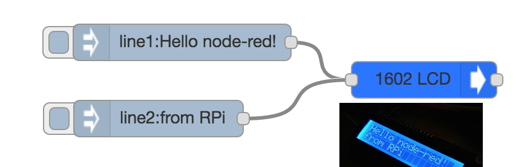

****Intro and Usage****

A simple node-red node that provides control of 1602/2004 LCDs with a PCF8574T/AT i2c driver backpack. Based on the following libraries:

https://github.com/sweetpi/i2c-lcd/

https://github.com/johnty/node-red-contrib-i2clcd

https://github.com/craigmw/lcdi2c

https://github.com/wilberforce/lcd-pcf8574

Updated to use i2c-bus instead of i2c, which will not compile on Armbian/Orange Pi.

Set node configuration to match your devices. Defaults to: i2c bus **0**, address **0x3f** and a **20** column by **4** row (2004) LCD.

Use topic **line1** through **line4** to send **msg.payload** to each line. Messages will be truncated at the length specified in the node's column setting.

Use topic **clear** to clear screen. 

Use topic **init** to re-initialize screen. 

Tested on Armbian Bionic on Orange Pi Zero (H2) hardware under Node 8.15.0, Node 10.15.0, Node 12.x

Tested on Armbian Bionic on Orange Pi One (H3) hardware under Node 10.15.0

Tested on Ubuntu Server 20.04 LTS on Raspberry Pi 3 B+ hardware under Node 12.x

****Requirements****

- ARM-based SBC with i2c bus
- 1602 or 2004 LCD panel that has a PCF8574T/AT i2c driver
- node dependencies: i2c-bus, sleep

****Installation****

- Install using npm, then restart Node-RED:

`cd $home`

`cd .node-red`

`npm install tek79/node-red-contrib-i2clcd-alt`

****Example****

`[{"id":"1bac6e76.a8fcc2","type":"tab","label":"Flow 1","disabled":false,"info":""},{"id":"52127114.471f9","type":"i2clcd-alt","z":"1bac6e76.a8fcc2","name":"i2clcd-alt","addr":"0x27","bus":"1","numcols":"20","numrows":"4","x":680,"y":280,"wires":[[]]},{"id":"3bf9759f.b152ea","type":"inject","z":"1bac6e76.a8fcc2","name":"","props":[{"p":"topic","vt":"str"},{"p":"payload"}],"repeat":"","crontab":"","once":false,"onceDelay":0.1,"topic":"line1","payload":"Hello node-red!","payloadType":"str","x":450,"y":240,"wires":[["52127114.471f9"]]},{"id":"a904459c.5e7ac8","type":"inject","z":"1bac6e76.a8fcc2","name":"","props":[{"p":"topic","vt":"str"},{"p":"payload"}],"repeat":"","crontab":"","once":false,"onceDelay":0.1,"topic":"line2","payload":"from RPi","payloadType":"str","x":430,"y":320,"wires":[["52127114.471f9"]]}]`

****Notes****

- Rate limiting of incoming messages is not necessary when using this library.

- Periodic re-initialization of the display may be necessary and seems dependent on outside factors. The display may become blank or display random characters. Sending **init** to the display at a fixed interval is recommended if you encounter this issue. If anyone is able to spot the cause of this issue, please suggest a solution in the issues section. Update, 2021-07-01: this issue was caused by nearby AC electrical interference.

- Not sure of your device's I2C address?

`sudo apt-get install -y python3-smbus i2c-tools`

`sudo i2cdetect -y 1` or subsitiute your I2C bus number in place of '1' if you know you are using a different bus.

Tek79
